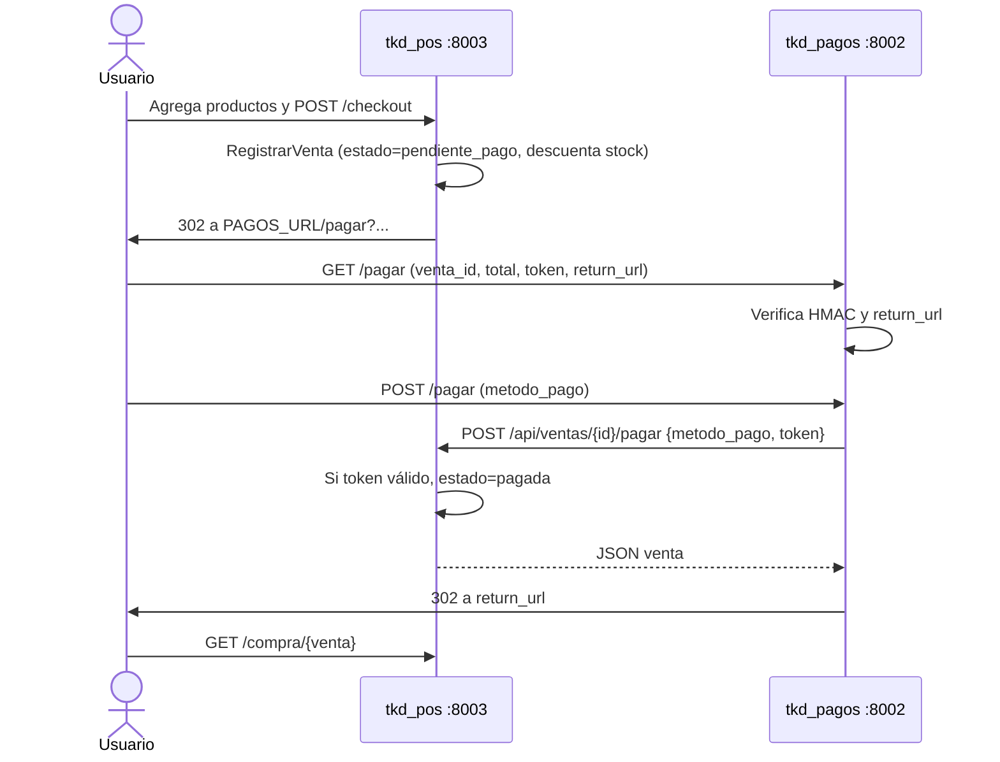

# Escuela de Taekwondo ERP

Monorepo de tres aplicaciones Laravel independientes que comparten una base MySQL (`escuela_taekwondo`) vía Docker Compose:

| Módulo | Carpeta | Puerto local (Docker Compose) | Rol |
| --- | --- | --- | --- |
| Alumnos | `tkd_alumnos` | `http://localhost:8001` | Expediente de alumnos |
| Pagos | `tkd_pagos` | `http://localhost:8002` | Colegiaturas (API) **y** checkout de la tienda (`/pagar`) |
| POS / tienda | `tkd_pos` | `http://localhost:8003` | Catálogo, carrito, ventas e inventario |

Este documento describe el estado actual de **catálogo + compra en línea** y el **contrato de integración POS ↔ Pagos**. Está pensado para que otro agente de IA (o un desarrollador) pueda extender el sistema sin romper el handshake.

---

## Qué se agregó en esta iteración

### `tkd_pos` — tienda estilo Mercado Libre

El POS dejó de ser solo API de ventas y ahora es una tienda web:

1. **Catálogo** de productos de taekwondo (uniforme, protección, entrenamiento, cinturones, calzado, accesorios).
2. Cada producto muestra **id**, **precio MXN**, **cantidad/stock** e **imagen de autoría original** en `tkd_pos/public/images/productos/`.
3. **Carrito de sesión** (no persiste en BD hasta el checkout).
4. **Checkout**: crea una `venta` en estado `pendiente_pago`, descuenta stock y **redirige al módulo de pagos**.
5. **Pantalla de compra** (`/compra/{venta}`) para ver si el pago ya fue confirmado.

Archivos clave:

| Pieza | Ubicación |
| --- | --- |
| Rutas web | `tkd_pos/routes/web.php` |
| API de ventas/pago | `tkd_pos/routes/api.php` |
| Catálogo | `app/Http/Controllers/CatalogoController.php` |
| Carrito HTTP | `app/Http/Controllers/CarritoController.php` |
| Carrito sesión | `app/Support/Carrito.php` |
| Checkout | `app/Http/Controllers/CheckoutController.php` |
| Alta de venta + stock | `app/Services/RegistrarVenta.php` |
| Confirmación de cobro | `VentaController::confirmarPago` |
| Token HMAC + URL de pagos | `app/Models/Venta.php` (`tokenPago()`, `urlModuloPago()`) |
| UI | `resources/views/{layouts,catalogo,carrito,compra}` + `public/css/tienda.css` |
| Seed del catálogo | `database/seeders/ProductoSeeder.php` |
| Tests | `tests/Feature/CatalogoTest.php` |

Campos nuevos:

- `productos.descripcion`, `productos.imagen_url`
- `ventas.estado` (`pendiente_pago` \| `pagada`)
- `ventas.referencia` (formato `TKD-000001`)

### `tkd_pagos` — colegiaturas + cobro de tienda

El módulo ya tenía API de **mensualidades** (`PagoController`, tabla `pagos`, estado de cuenta). Encima se agregó el checkout de la tienda **sin reemplazar esa API**:

1. Recibe la orden de la tienda por query string en `GET /pagar` (`CheckoutTiendaController`).
2. Valida el **token HMAC** y que `return_url` pertenezca al POS.
3. Muestra un checkout (tarjeta o transferencia). **No guarda PAN/CVV**.
4. Confirma el cobro llamando al POS: `POST {POS_URL}/api/ventas/{id}/pagar`.
5. Redirige al comprador a `return_url` (pantalla de compra del POS).

La API existente sigue en `routes/api.php`:

- `POST /api/pagos` — registro de colegiatura
- `GET /api/alumnos/{alumno_id}/estado-cuenta` — estado de cuenta

Archivos clave del checkout de tienda:

| Pieza | Ubicación |
| --- | --- |
| Checkout tienda | `app/Http/Controllers/CheckoutTiendaController.php` |
| Colegiaturas (no tocar el contrato) | `app/Http/Controllers/PagoController.php` |
| Cliente HTTP al POS | `app/Services/ConfirmarPagoPos.php` |
| UI tienda | `resources/views/pagos/*`, `public/css/pagos.css` |
| Tests handshake | `tests/Feature/PagoTest.php` |

### Docker Compose

- Servicio `tkd_pos` en el puerto **8003** y `tkd_pagos` en **8002**.
- `tkd_pos` recibe `PAGOS_URL=http://localhost:8002` (URL que usa el **navegador**).
- `tkd_pagos` llama al POS por red Docker: `POS_URL=http://tkd_pos:8000`.
- `POS_PUBLIC_URL=http://localhost:8003` permite validar el `return_url` del navegador aunque la API interna use el hostname del contenedor.

---

## Cómo se conecta el POS con el módulo de pagos

Los módulos **no comparten sesión**. Se comunican con:

1. Un **redirect del navegador** POS → Pagos (inicio del cobro).
2. Un **HTTP server-to-server** Pagos → POS (cierre de la venta).
3. Un **redirect del navegador** Pagos → POS (regreso a la compra).



### 1. POS crea la intención de pago

`CheckoutController` llama a `RegistrarVenta` y redirige a `Venta::urlModuloPago()`.

URL generada:

```text
{PAGOS_URL}/pagar?venta_id={id}&referencia={TKD-00000N}&total={0.00}&token={hmac}&return_url={APP_URL}/compra/{id}
```

Query params (todos obligatorios):

| Param | Origen | Notas |
| --- | --- | --- |
| `venta_id` | `ventas.id` | Entero |
| `referencia` | `ventas.referencia` | `TKD-` + id con padding 6 |
| `total` | `number_format(total, 2, '.', '')` | Siempre `"123.45"`, **nunca** `"123.4"` ni `"123"` |
| `token` | HMAC-SHA256 | Ver fórmula abajo |
| `return_url` | `route('compra.show', $venta)` | Debe empezar por `POS_URL` o `POS_PUBLIC_URL` |

### 2. Fórmula del token (no cambiar el formato)

Ambos módulos deben calcular **exactamente**:

```text
token = hash_hmac('sha256', "{venta_id}|{total_formateado}", PAGO_SECRET)
```

Ejemplo: venta `7` con total `250.00` y secreto `test-secret`:

```text
payload = "7|250.00"
token   = HMAC-SHA256(payload, secreto)
```

Implementaciones:

- POS: `App\Models\Venta::tokenPago()` usando `config('services.pagos.secret')` (`PAGO_SECRET`).
- Pagos: `PagoController::validarIntencion()` usando `config('services.pos.secret')` (`PAGO_SECRET`).

**El secreto debe ser el mismo valor en los dos `.env`.** Si el total se serializa distinto (`200` vs `200.00`) el token no coincide y Pagos responde 403.

### 3. Pagos confirma en el POS

`ConfirmarPagoPos` hace:

```http
POST {POS_URL}/api/ventas/{venta_id}/pagar
Accept: application/json
Content-Type: application/json

{
  "metodo_pago": "tarjeta" | "transferencia",
  "token": "<mismo HMAC>"
}
```

`VentaController::confirmarPago`:

- 403 si el token no coincide (`hash_equals`).
- Si ya está `pagada`, es idempotente (no vuelve a cambiar método/estado de forma destructiva más allá del early return).
- Si estaba `pendiente_pago`, actualiza `metodo_pago` y `estado = pagada`.
- **No vuelve a descontar stock** (eso ocurrió al crear la venta).

Prefijo Laravel: las rutas de `routes/api.php` viven bajo `/api`.

### 4. Variables de entorno del contrato

**`tkd_pos/.env`**

| Variable | Uso |
| --- | --- |
| `APP_URL` | Base de `return_url` (`http://localhost:8003`) |
| `PAGOS_URL` | Destino del redirect del navegador (`http://localhost:8002`) |
| `PAGO_SECRET` | Secreto HMAC compartido |

**`tkd_pagos/.env`**

| Variable | Uso |
| --- | --- |
| `POS_URL` | Base HTTP **interna** para confirmar (`http://tkd_pos:8000` en Docker, `http://localhost:8003` en local) |
| `POS_PUBLIC_URL` | Origen permitido de `return_url` (`http://localhost:8003`) |
| `PAGO_SECRET` | El mismo secreto que el POS |

Config Laravel:

- POS: `config/services.php` → `services.pagos.url`, `services.pagos.secret`
- Pagos: `config/services.php` → `services.pos.url`, `services.pos.public_url`, `services.pos.secret`

### 5. Estados de `ventas.estado`

| Estado | Cuándo |
| --- | --- |
| `pendiente_pago` | Checkout web, o `POST /api/ventas` con `metodo_pago=pendiente` |
| `pagada` | Cobro confirmado por Pagos, o alta API con método distinto de `pendiente` |

`metodo_pago` en checkout web nace como `pendiente` y se reemplaza por `tarjeta` o `transferencia`.

---

## Rutas que un agente no debe romper

### POS web

| Método | Ruta | Nombre |
| --- | --- | --- |
| GET | `/` | `catalogo.index` |
| GET | `/producto/{producto}` | `catalogo.show` |
| GET | `/carrito` | `carrito.index` |
| POST | `/carrito` | `carrito.store` |
| PATCH | `/carrito/{producto}` | `carrito.update` |
| DELETE | `/carrito/{producto}` | `carrito.destroy` |
| POST | `/checkout` | `checkout.store` |
| GET | `/compra/{venta}` | `compra.show` |

### POS API

| Método | Ruta | Acción |
| --- | --- | --- |
| POST | `/api/ventas` | Alta de venta (POS interno / otros módulos) |
| POST | `/api/ventas/{venta}/pagar` | Cierre de cobro (solo módulo de pagos) |

### Pagos web

| Método | Ruta | Nombre |
| --- | --- | --- |
| GET | `/` | Landing informativa |
| GET | `/pagar` | Formulario checkout tienda (`CheckoutTiendaController`) |
| POST | `/pagar` | Procesa cobro de tienda y llama al POS |

Separado (no mezclar con el catálogo):

| Método | Ruta | Acción |
| --- | --- | --- |
| POST | `/api/pagos` | Alta de colegiatura de alumno |
| GET | `/api/alumnos/{id}/estado-cuenta` | Estado de cuenta |

---

## Cómo levantar el entorno

```bash
docker compose up -d --build
docker compose exec tkd_pos php artisan migrate --force
docker compose exec tkd_pos php artisan db:seed --force
```

Requisitos: copiar `tkd_pos/.env.example` → `tkd_pos/.env` y `tkd_pagos/.env.example` → `tkd_pagos/.env`, generar `APP_KEY` en ambos.

Tarjeta de desarrollo (no se persiste): número `4242424242424242`, vencimiento `MM/AA`, CVV 3-4 dígitos.

### Tests

```bash
# dentro de cada app, o vía imagen composer:2
php artisan test
```

- POS: catálogo, carrito, redirect a `/pagar`, confirmación API.
- Pagos: token válido, token inválido, HTTP fake al POS y redirect a `return_url`.

---

## Reglas para agentes de IA que toquen este flujo

1. **No cambien el payload del HMAC** (`id|total` con dos decimales y punto).
2. **Mantengan `PAGO_SECRET` idéntico** en POS y Pagos.
3. Distingan **URL de navegador** (`PAGOS_URL`, `POS_PUBLIC_URL`, `APP_URL`) de **URL interna Docker** (`POS_URL=http://tkd_pos:8000`).
4. El stock se reserva al crear la venta; el pago solo cambia estado. Si se cancela una venta pendiente en el futuro, hay que **reponer stock** (hoy no hay cancelación).
5. `Carrito` es singleton de sesión (`AppServiceProvider`); no mezclarlo con BD.
6. Imágenes del catálogo son assets locales de autoría original; no sustituir por URLs de stock con copyright.
7. `tkd_pagos` no tiene tabla de ventas: la fuente de verdad de la orden es `tkd_pos`.
9. En `tkd_pagos`, `PagoController` es **colegiaturas**. El cobro de catálogo vive en `CheckoutTiendaController` y rutas `/pagar`. No mezclar payloads.
